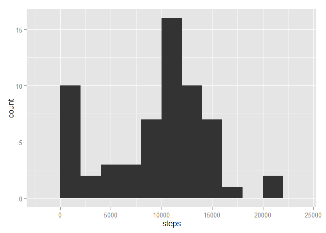
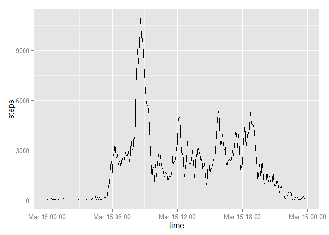
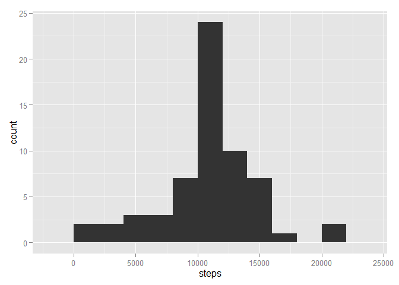

# Reproducible Research: Peer Assessment 1
## Loading necessary libraries

```r
library(ggplot2)
```
## Loading and preprocessing the data

```r
data <- read.csv("activity.csv")
i <- data$interval
time <- sprintf("%02d:%02d", i %/% 100, i %% 100)
x <- paste(data$date, time) 
## data <- transform(data, exact_time = strptime(x, "%Y-%m-%d %H:%M"))
data <- transform(data, time = time)
data <- transform(data, date = as.Date(data$date, "%Y-%m-%d"))
head(data)
```

```
##   steps       date interval  time
## 1    NA 2012-10-01        0 00:00
## 2    NA 2012-10-01        5 00:05
## 3    NA 2012-10-01       10 00:10
## 4    NA 2012-10-01       15 00:15
## 5    NA 2012-10-01       20 00:20
## 6    NA 2012-10-01       25 00:25
```

## What is mean total number of steps taken per day?
1. Calculate the total number of steps taken per day

```r
aggData <- aggregate(data$steps, by = list(date = data$date), FUN = sum, na.rm = TRUE)
colnames(aggData)[2] <- "steps"
head(aggData)
```

```
##         date steps
## 1 2012-10-01     0
## 2 2012-10-02   126
## 3 2012-10-03 11352
## 4 2012-10-04 12116
## 5 2012-10-05 13294
## 6 2012-10-06 15420
```

2. Plot histogram of steps taken per day

```r
qplot(steps, data = aggData, binwidth = 2000)
```

 

3. Calculate and report the mean and median of the total number of steps taken per day

```r
summary(aggData$steps)
```

```
##    Min. 1st Qu.  Median    Mean 3rd Qu.    Max. 
##       0    6778   10400    9354   12810   21190
```

## What is the average daily activity pattern?
1. Plot the 5-minute interval (x-axis) and the average number of steps taken, averaged across all days (y-axis)

```r
aggData2 <- aggregate(data$steps, by = list(time = data$time), FUN = sum, na.rm = TRUE)
colnames(aggData2)[2] <- "steps"
aggData2 <- transform(aggData2, time = strptime(aggData2$time, "%H:%M"))
qplot(time, steps, data = aggData2, geom = "line")
```

 

2. Which 5-minute interval, on average across all the days in the dataset, contains the maximum number of steps? (couldn't get rid of the automatically added date)

```r
aggData2[which.max(aggData2$steps), 1]
```

```
## [1] "2015-03-15 08:35:00 EDT"
```

## Imputing missing values
1. Calculate and report the total number of missing values in the dataset

```r
sum(is.na(data$steps))
```

```
## [1] 2304
```

2. Fill in the missing values with the mean of steps of the time interval

```r
newData <- data
tmp <- aggregate(data$steps, by = list(time = data$time), FUN = mean, na.rm = TRUE)
for(i in 1:length(newData$steps)) {
        if(is.na(newData[i, 1])) {
                newData[i, 1] <- tmp[which(tmp$time == newData[i, 4]), 2]
        }
}
```
3. Create a new dataset that is equal to the original dataset but with the missing data filled in. (already done, stored as newData above) 

4. Make a histogram of the total number of steps taken each day and Calculate and report the mean and median total number of steps taken per day.

```r
aggData3 <- aggregate(newData$steps, by = list(date = data$date), FUN = sum)
colnames(aggData3)[2] <- "steps"
qplot(steps, data = aggData3, binwidth = 2000)
```

 

```r
summary(aggData3$steps)
```

```
##    Min. 1st Qu.  Median    Mean 3rd Qu.    Max. 
##      41    9819   10770   10770   12810   21190
```

## Are there differences in activity patterns between weekdays and weekends?
1. Create a new factor variable in the dataset with two levels - "weekday" and "weekend" indicating whether a given date is a weekday or weekend day.

```r
newData <- transform(newData, weekday = weekdays(newData[,2]))
ind <- newData$weekday %in% c('Saturday','Sunday')
```


